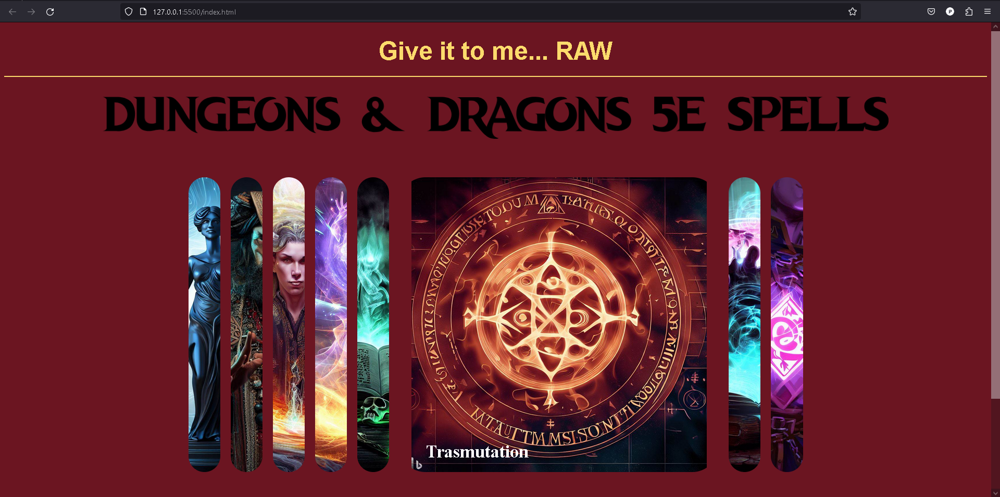
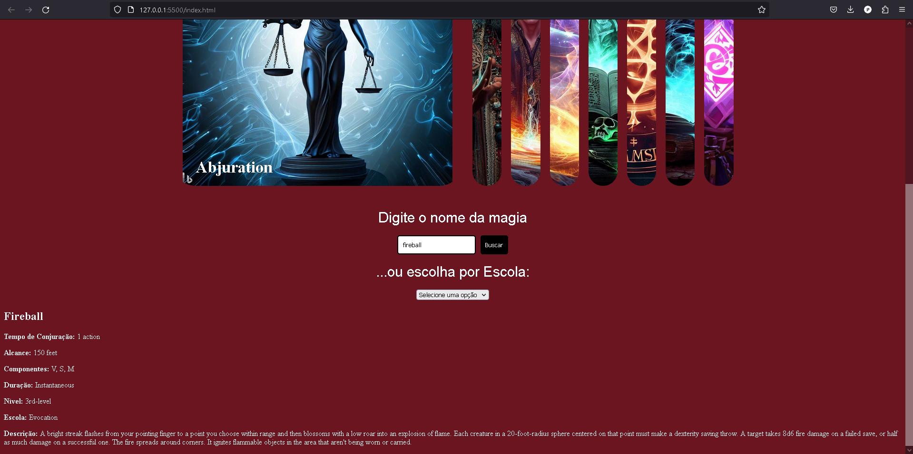
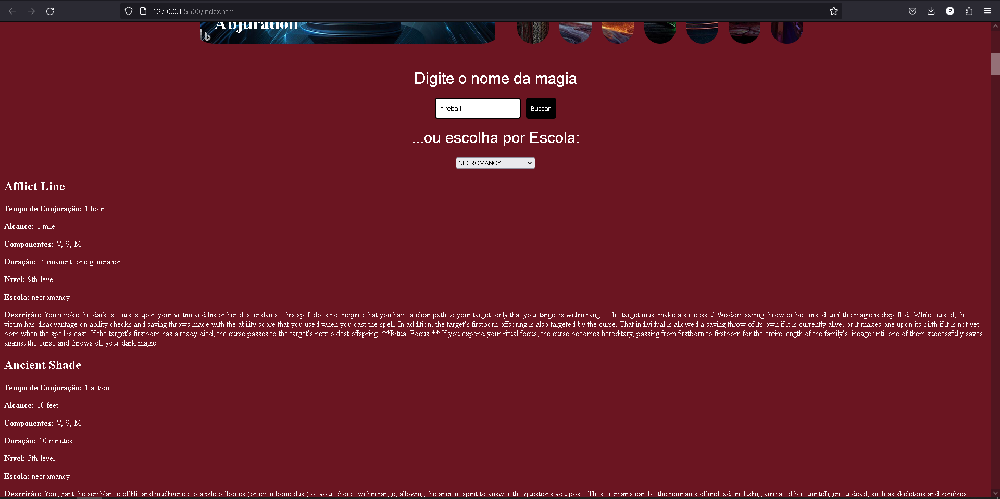

# p3-jeofton-grupo-dnd

O RPG (Role Playing Game) é um tipo de jogo em que os jogadores assumem papéis de personagens fictícios e interagem em um mundo imaginário, seguindo uma narrativa. O Dungeons & Dragons (D&D) é um dos RPGs mais populares e amplamente conhecidos, criado na década de 1970 por Gary Gygax e Dave Arneson. Ele é jogado com regras e mecânicas que são definidas em livros de referência, sendo geralmente um jogo de mesa, mas também pode ser jogado online.

O D&D é considerado um marco na história dos jogos de RPG, sendo uma referência para muitos outros sistemas de jogo que surgiram posteriormente. A importância do D&D está na sua capacidade de proporcionar uma experiência de jogo imersiva, onde os jogadores podem criar personagens únicos, explorar mundos fantásticos, enfrentar desafios e resolver problemas através de narrativas interativas.

No entanto, uma das características do D&D é a complexidade das suas regras, especialmente no que diz respeito ao combate tático. O sistema possui um conjunto extenso de regras que governam ações de combate, como movimento, ataque, defesa e uso de habilidades especiais. Isso pode tornar o jogo desafiador para jogadores novatos ou para aqueles que preferem um estilo de jogo mais simplificado.

Além disso, o material do D&D é vasto, com uma grande quantidade de opções de personagens, itens, criaturas e magias. A lista de consulta pode se tornar extensa e complexa, sendo necessário consultar vários livros e referências durante o jogo para encontrar as informações necessárias. Entre as diversas listas de consulta, a lista de magias é uma das mais importantes.

As magias no D&D são poderes místicos que os personagens podem usar para realizar feitos impossíveis. Elas são classificadas em níveis, variando de 0 a 9, e são divididas em diferentes tipos, como magias de ataque, cura, proteção, controle e muito mais. Cada classe de personagem possui sua própria lista de magias, o que pode tornar a consulta e seleção de magias um desafio, considerando a quantidade de opções disponíveis.

Para auxiliar os jogadores nessa tarefa, uma API (Interface de Programação de Aplicativos) pode ser uma ferramenta valiosa. A API permite o acesso a dados e informações do jogo de forma programática, tornando mais fácil e rápida a consulta e seleção de magias, por exemplo. Um exemplo de API útil para jogadores de D&D é a presente em https://api.open5e.com/, que disponibiliza uma ampla gama de informações sobre as regras, magias, criaturas e outros elementos do D&D 5ª edição.

O consumo de API para D&D 5e pode trazer inúmeras vantagens para os jogadores, permitindo uma pesquisa mais eficiente de informações, facilitando a seleção de magias de acordo com as necessidades e características de cada personagem, e melhorando a experiência de jogo como um todo. Com a ajuda de uma API, os jogadores podem otimizar suas escolhas, entender melhor as mecânicas do jogo e aproveitar ao máximo o vasto universo do D&D.

Link da API consumida: https://api.open5e.com/spells

